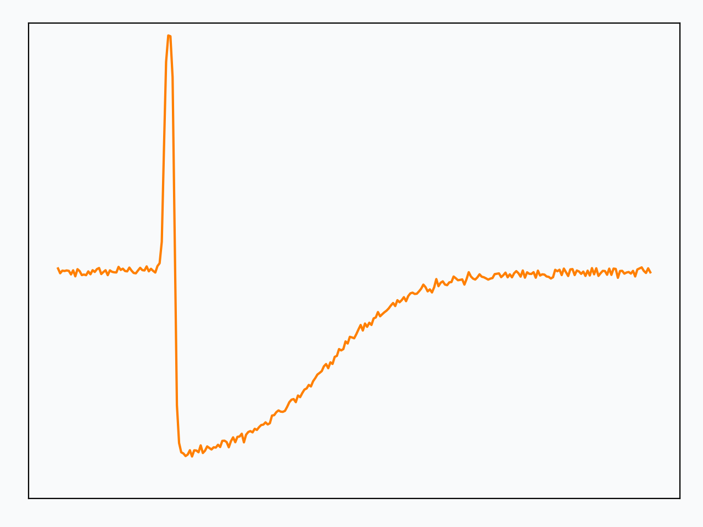
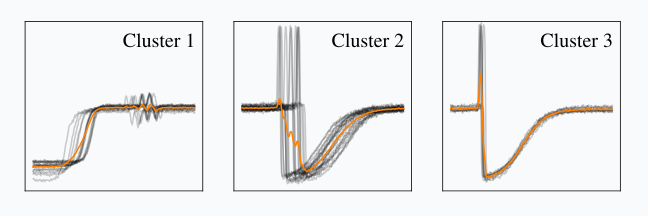
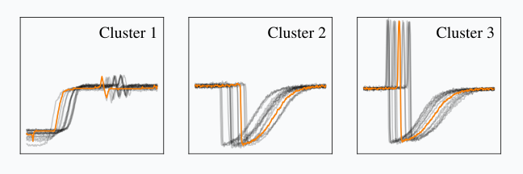
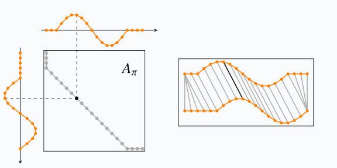
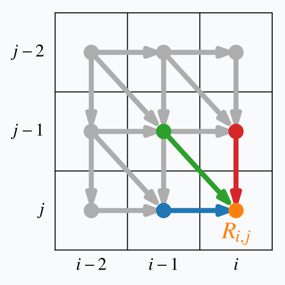
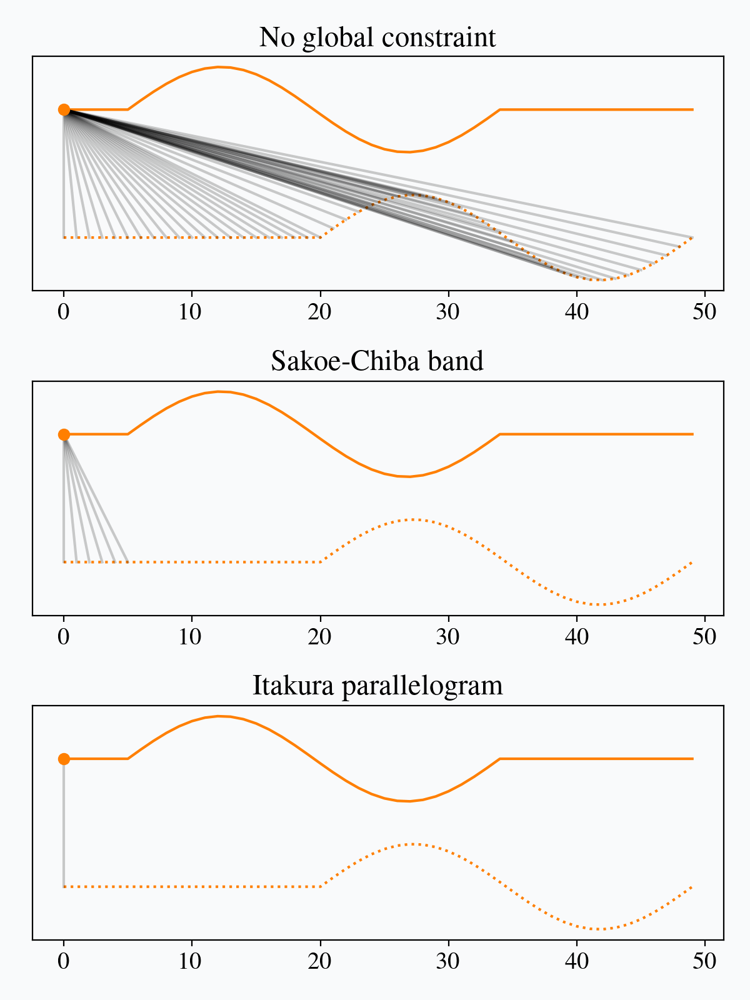

# Alignment-based metrics

This post is the first in a series about assessing similarity between time series.
More specifically, we will be interested in _alignment-based metrics_,<label for="sn-1" class="sidenote-toggle sidenote-number"></label>
<input type="checkbox" id="sn-1" class="sidenote-toggle" />
Here we use the term "metrics" in a pretty unformal manner, that is an equivalent of "similarity measure". 
that rely on a temporal alignment of the series in order to assess their similarity.

Before entering into more details about these metrics, let us define our base objects: time series.
In the following, a time series is a sequence of features: $x = (x_0, \dots, x_{n-1})$.
All features from a time series lie in the same space $\mathbb{R}^p$.
Below is an example univariate<label for="sn-2" class="sidenote-toggle sidenote-number"></label>
<input type="checkbox" id="sn-2" class="sidenote-toggle" />
A time series is said univariate if all its feature vectors are monodimensional ($p=1$). time series:

<figure>
    <video playsinline muted autoplay controls loop width="80%">
        <source src="fig/time_series.webm" type="video/webm" />
        <source src="fig/time_series.mp4" type="video/mp4" />
        
    </video>
    <figcaption> 
        Example univariate time series. 
        The horizontal axis is the time axis and the vertical one is dedicated to (univariate) feature values.
    </figcaption>
</figure>

Let us now illustrate the typical behavior of alignment-based metrics with an example.

<figure>
    
    <figcaption> 
        Comparison between DTW and Euclidean distance.
        Note that, for the sake of visualization, time series are shifted vertically, but one should imagine that feature value ranges (y-axis values) match.
    </figcaption>
</figure>

Here, we are computing similarity between two time series using either Euclidean distance (left) or Dynamic Time Warping (DTW, right), which is an instance of alignment-based metric that we will present in more details later in this post.
In both cases, the returned similarity is the sum of distances between matched features.<label for="sn-match" class="sidenote-toggle sidenote-number"></label>
<input type="checkbox" id="sn-match" class="sidenote-toggle" />
Here, matches are represented by gray lines and the distance associated to a match between $i$-th feature in time series $x$ and $j$-th feature in time series $x^\prime$ is $d(x_i, x^\prime_j)$. 
Note how DTW matches distinctive patterns of the time series, which is likely to result in a more sound similarity assessment than when using Euclidean distance that matches timestamps regardless of the feature values.

Now let us see how this property translates in a machine learning setting.
Suppose we are given the following unlabelled time series dataset:

<figure>
    <video playsinline muted autoplay controls loop width="80%">
        <source src="fig/dataset_viz.webm" type="video/webm" />
        <source src="fig/dataset_viz.mp4" type="video/mp4" />
        
    </video>
    <figcaption> 
        A time series dataset.
    </figcaption>
</figure>

If you look carefully at this dataset, you might notice that there are three families of series in it.
Let us see if a classical clustering algorithm can detect these three typical shapes.
To do so, we will use the $k$-means algorithm, which aims at forming clusters as compact as possible with respect to a given similarity metric.
By default the metric is Euclidean distance, which gives, in our example:

<figure>
    
    <figcaption> 
        Euclidean $k$-means clustering of the dataset presented in Figure 3. 
        Each subfigure represents series from a given cluster and their centroid (in orange).
    </figcaption>
</figure>

As one can see, this is not fully satisfactory.
First, Cluster 2 mixes two distinct time series shapes.
Second, the barycenters for each cluster are not especially representative of the time series gathered in the clusters.
Even Cluster 1, which seems to be the "purest" one, suffers from this last pitfall, since the local oscillations that are observed towards the end of the series have a lower magnitude in the reconstructed barycenter than in the series themselves.

Let us now switch to Dynamic Time Warping as the core metric for our $k$-means algorithm.
The resulting clusters are this time closer to what one could expect:

<figure>
    
    <figcaption> 
        DTW $k$-means clustering of the dataset presented in Figure 3. 
        Each subfigure represents series from a given cluster and their centroid (in orange).
    </figcaption>
</figure>

This is because time series in each group are very similar **up to a time shift**, which is a known invariant of Dynamic Time Warping, as we will see.

# Dynamic Time Warping

We will now review Dynamic Time Warping (DTW) in more details.
DTW is a similarity measure between time series that has been introduced independently in the literature by [@vintsyuk1968speech] and [@sakoe1978dynamic],
in both cases for speech applications.<label for="sn-3" class="sidenote-toggle sidenote-number"></label>
<input type="checkbox" id="sn-3" class="sidenote-toggle" />
Note that, in this series of posts, we will stick to the formalism from [@sakoe1978dynamic], which is more standard in the literature.

Let us consider two time series $x$ and
${x}^\prime$ of respective lengths $n$ and
$m$.
Here, all elements $x_i$ and $x^\prime_j$ are assumed to lie in the same
$p$-dimensional space and the exact timestamps at which observations occur are
disregarded: only their ordering matters.

Dynamic Time Warping seeks for the temporal alignment<label for="sn-temp-align" class="sidenote-toggle sidenote-number"></label>
<input type="checkbox" id="sn-temp-align" class="sidenote-toggle" />
A temporal alignment is a matching between time indexes of the two time series. that minimizes Euclidean distance between
aligned series, as illustrated in the Figure below:

<figure>
    <video playsinline muted autoplay controls loop width="60%">
        <source src="fig/dtw_path.webm" type="video/webm" />
        <source src="fig/dtw_path.mp4" type="video/mp4" />
        
    </video>
    <figcaption> 
        Dynamic Time Warping is equivalent to minimizing Euclidean distance between aligned time series under all admissible temporal alignments.
        Cyan dots correspond to repetitions of time series elements induced by the optimal temporal alignment retrieved by DTW.
        Note how, once inserted these repeated elements, all matchings become vertical, which is the typical behavior of Euclidean distance, as shown in Figure 2.
    </figcaption>
</figure>

## Problem formulation

More formally, the optimization problem writes:

$$DTW_q({x}, {x}^\prime) =
    \min_{\pi \in \mathcal{A}({x}, {x}^\prime)}
        \left( \sum_{(i, j) \in \pi} d(x_i, x^\prime_j)^q \right)^{\frac{1}{q}}
$$ {#eq:dtw}

Here, an **alignment path** $\pi$ of length $K$ is a sequence of $K$ index pairs
$\left((i_0, j_0), \dots , (i_{K-1}, j_{K-1})\right)$ and $\mathcal{A}({x}, {x}^\prime)$ is the set of all admissible paths.
In order to be considered admissible, a path should satisfy the following conditions:

* Beginning (resp. end) of time series are matched together: 

  * $\pi_0 = (0, 0)$ 
  * $\pi_{K-1} = (n - 1, m - 1)$

* The sequence is monotonically increasing in both $i$ and $j$ and all time series indexes should appear at least once, which can be written:

  * $i_{k-1} \leq i_k \leq i_{k-1} + 1$
  * $j_{k-1} \leq j_k \leq j_{k-1} + 1$

### Dot product notation

Another way to represent a DTW path is to use a binary matrix whose non-zero entries are those corresponding to a 
matching between time series elements.
This representation is related to the index sequence representation used above through:

\begin{equation}
(A_\pi)_{i,j} = \left\{ \begin{array}{rl} 1 & \text{ if } (i, j) \in \pi \\
                                      0 & \text{ otherwise}
                        \end{array} \right. \,\,\,\,\,\,\, .
\end{equation}

This is illustrated in the Figure below where nonzero entries in the binary matrix are represented as dots and the equivalent sequence of matchings is produced on the right:

<figure>
    
    <figcaption> 
        Dynamic Time Warping path represented as a binary matrix. 
        (Left) Each dot on the path indicates a nonzero entry in $A_\pi$, hence the matching of an element in $x$ with an element in $x^\prime$.
        Note the correspondence between this representation and the one on the right.
    </figcaption>
</figure>

Using matrix notation, Dynamic Time Warping can be written as the minimization of a dot product between matrices:

\begin{equation*}
DTW_q({x}, {x}^\prime) =
    \min_{\pi \in \mathcal{A}({x}, {x}^\prime)}
        \left\langle A_\pi,  D_q({x}, {x}^\prime) \right\rangle^{\frac{1}{q}}
\end{equation*}

where $D_q({x}, {x}^\prime)$ stores distances $d(x_i, x^\prime_j)$ at the power $q$.

## Algorithmic Solution

Though the optimization problem in {@eq:dtw} is minimization over a finite set, the number of admissible paths (coined 
[Delannoy number](https://en.wikipedia.org/wiki/Delannoy_number)) becomes very large even for moderate time series lengths.
Assuming $m$ and $n$ are the same order, there exists $O\left(\frac{(3 + 2\sqrt{2})^n}{\sqrt{n}}\right)$ different paths in 
$\mathcal{A}(x, x^\prime)$, which makes it intractable to actually list all paths sequentially in order to compute the minimum.

Fortunately, an exact solution to this optimization problem can be found using dynamic programming.
Dynamic programming relies on recurrence, which consists in linking the solution of a given problem to solutions of (easier) sub-problems.
Once this link is known, the dynamic programming approach solves the original problem by recursively solving required sub-problems and storing their solutions for later use (so as not to re-compute subproblems several times).

In the case of DTW, we need to rely on the following quantity:

$$
    R_{i,j} = DTW_q({x}_{\rightarrow i}, {x}^\prime_{\rightarrow j})^q
$$

where the notation ${x}_{\rightarrow i}$ denotes time series ${x}$ observed up to timestamp $i$ (included).
Then, we can observe that:

$$
\begin{aligned}
R_{i,j} 
    &= \min_{\pi \in \mathcal{A}({x}_{\rightarrow i}, {x}^\prime_{\rightarrow j})}
        \sum_{(k, l) \in \pi} d(x_k, x^\prime_l)^q \\
    &\stackrel{*}{=} d(x_i, x^\prime_j)^q +
        \min_{\pi \in \mathcal{A}({x}_{\rightarrow i}, {x}^\prime_{\rightarrow j})}
            \sum_{(k, l) \in \pi[:-1]} d(x_k, x^\prime_l)^q \\
    &\stackrel{**}{=} d(x_i, x^\prime_j)^q +
        \min ({\color{MidnightBlue}R_{i-1, j}}, {\color{Red}R_{i, j-1}}, {\color{ForestGreen}R_{i-1, j-1}})
\end{aligned}
$$ {#eq:rec}

$(*)$ comes from the constraints on admissible paths $\pi$: the last element on an admissible path needs to match the last elements of the series.
Also, $(**)$ results from the contiguity conditions on the admissible paths.
Indeed, a path that would align time series ${x}_{\rightarrow i}$ and ${x}^\prime_{\rightarrow j}$ necessarily encapsulates either:

* a path that would align time series ${x}_{\rightarrow i - 1}$ and ${x}^\prime_{\rightarrow j}$, or
* a path that would align time series ${x}_{\rightarrow i}$ and ${x}^\prime_{\rightarrow j - 1}$, or
* a path that would align time series ${x}_{\rightarrow i - 1}$ and ${x}^\prime_{\rightarrow j - 1}$,

as illustrated in the Figure below:

<figure>
    
    <figcaption> 
        Valid DTW transitions.
    </figcaption>
</figure>

This implies that filling a matrix that would store $R_{i,j}$ terms row-by-row<label for="sn-row-wise" class="sidenote-toggle sidenote-number"></label>
<input type="checkbox" id="sn-row-wise" class="sidenote-toggle" />
In practice, the matrix could be filled column-by-column too. The important part is that the terms $R_{i-1, j}$, $R_{i, j-1}$ and $R_{i-1, j-1}$ are accessible when computing $R_{i, j}$. When vectorizing code is of importance, an even better strategy is to compute the $R$ terms one anti-diagonal at a time [@tralie2020exact].
 is sufficient to retrieve 
$DTW_q({x}, {x}^\prime)$ as ${R_{n-1, m-1}}^{\frac{1}{q}}$.

These observations result in the following $O(mn)$ algorithm to compute the exact optimum for DTW 
(assuming computation of $d(\cdot,\cdot)$ is $O(1)$):

<pre>
  <code class="language-python">
def dtw(x, x_prime, q=2):
  for i in range(len(x)):
    for j in range(len(x_prime)):
      R[i, j] = d(x[i], x_prime[j]) ** q
      if i > 0 or j > 0:
        R[i, j] += min(
          R[i-1, j  ] if i > 0             else inf,
          R[i  , j-1] if j > 0             else inf,
          R[i-1, j-1] if (i > 0 and j > 0) else inf
          # Note that these 3 terms cannot all be 
          # inf if we have (i > 0 or j > 0)
        )

  return R[-1, -1] ** (1. / q)
  </code>
</pre>

## Properties

Dynamic Time Warping holds a few of the basic metric properties, such as:

* $DTW_q({x}, {x}^\prime) \geq 0$ for any time series ${x}$ and ${x}^\prime$;
* $DTW_q({x}, {x}) = 0$ for any time series ${x}$.

However, mathematically speaking, DTW is not a valid metric since it
satisfies neither the triangular inequality nor the identity of indiscernibles.
More specifically, DTW is invariant to time shifts.
In other words, if ${x}$ is a time series that is constant except for a motif that
occurs at some point in the series, and if ${x}_{+k}$ is a
copy of ${x}$ in which the motif is temporally shifted by $k$ timestamps,
then $DTW_q({x}, {x}_{+k}) = 0$, as illustrated below:

<figure>
    <video playsinline muted autoplay controls loop width="80%">
        <source src="fig/dtw_shift.webm" type="video/webm" />
        <source src="fig/dtw_shift.mp4" type="video/mp4" />
        
    </video>
    <figcaption> 
        Contrary to Euclidean distance, DTW is invariant to time shifts between series.
    </figcaption>
</figure>

## Setting Additional Constraints

As we have seen, Dynamic Time Warping is invariant to time shifts, whatever their temporal span.
In order to allow invariances to local deformations only, one can impose additional constraints 
on the set of admissible paths.

Such constraints typically translate into enforcing nonzero entries in $A_\pi$ to stay 
close to the diagonal.
The Sakoe-Chiba band [@sakoe1978dynamic] is a constant-width band parametrized by a radius $r$ (also called warping window size sometimes). 
Another standard global constraint is the Itakura parallelogram [@itakura1975minimum] that sets a maximum slope $s$ for alignment
paths, which leads to a parallelogram-shaped constraint.
The impact of these parameters is illustrated in the Figure below:

<figure>
    <video playsinline muted autoplay controls loop width="45%">
        <source src="fig/sakoechiba_matrices.webm" type="video/webm" />
        <source src="fig/sakoechiba_matrices.mp4" type="video/mp4" />
        
    </video>
    <video playsinline muted autoplay controls loop width="45%">
        <source src="fig/itakura_matrices.webm" type="video/webm" />
        <source src="fig/itakura_matrices.mp4" type="video/mp4" />
        
    </video>
    <figcaption>
        Visualization of DTW global constraints: Sakoe-Chiba band (left) and Itakura parallelogram (right).
        Here, each colored cell corresponds to an index pair $(i, j)$ that is valid under the considered constraint.
    </figcaption>
</figure>

In practice, global constraints on admissible DTW paths restrict the set of possible matches for each element in a time series.
The number of possible matches for an element is always $2r+1$ for Sakoe-Chiba constraints (except for border elements), 
while it varies depending on the time index for Itakura parallelograms:

<figure>
    <video playsinline muted autoplay controls loop width="80%">
        <source src="fig/dtw_global_constraints.webm" type="video/webm" />
        <source src="fig/dtw_global_constraints.mp4" type="video/mp4" />
        
    </video>
    <figcaption>
        Valid matches for several global constraint schemes.
        For each position in the upper time series, all valid matches in the lower time series are represented through gray connections.
    </figcaption>
</figure>

As stated above, setting such constraints leads to restricting the shift invariance to local shifts only.
Typically, DTW with a Sakoe-Chiba band constraint of radius $r$ is invariant to time shifts of magnitude up to $r$,
but is no longer invariant to longer time shifts:

<figure>
    <video playsinline muted autoplay controls loop width="80%">
        <source src="fig/sakoe_shift.webm" type="video/webm" />
        <source src="fig/sakoe_shift.mp4" type="video/mp4" />
        
    </video>
    <figcaption>
        Impact of time shifts on a DTW with a Sakoe-Chiba band constraint of radius $r$.
    </figcaption>
</figure>

# Conclusion

We have seen in this post how alignment-based metrics can prove useful when dealing with temporally shifted time series.
We have presented in more details the most common of these metrics, which is Dynamic Time Warping (DTW).
If you enjoyed this post, stay tuned, there is another one on the specific topic of the [differentiability of DTW](softdtw.html).
