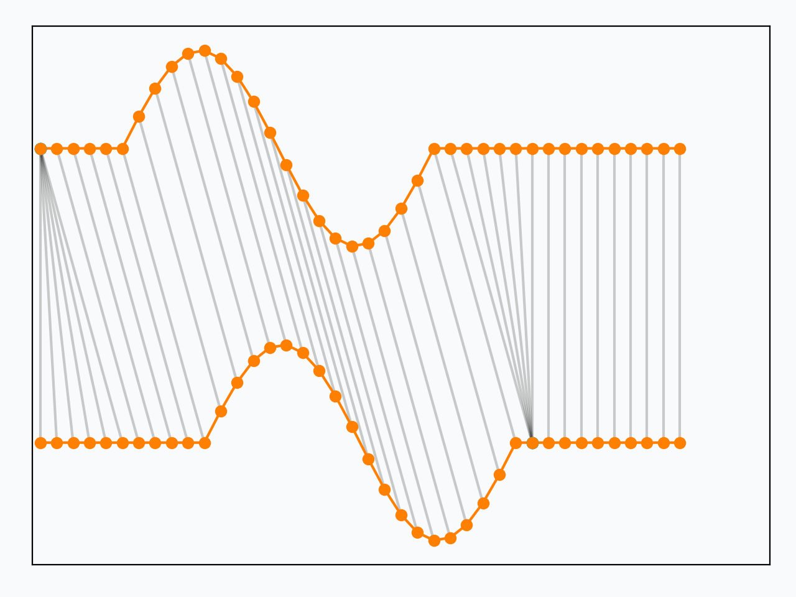

# Alignment-based metrics

This post is the first in a series about assessing similarity between time series.
More specifically, we will be interested in _alignment-based metrics_,<label for="sn-1" class="sidenote-toggle sidenote-number"></label>
<input type="checkbox" id="sn-1" class="sidenote-toggle" />
Here we use the term "metrics" in a pretty unformal manner, that is an equivalent of "similarity measure". 
that rely on a temporal alignment of the series in order to assess their similarity.

Before entering into more details about these metrics, let us define our base objects: time series.
In the following, a time series is a sequence of features: $x = \left(x_0, \dots, x_{n-1}\right)$.
All features from a time series lie in the same space $\mathbb{R}^p$.
Below is an example univariate<label for="sn-2" class="sidenote-toggle sidenote-number"></label>
<input type="checkbox" id="sn-2" class="sidenote-toggle" />
A time series is said univariate if all its feature vectors are monodimensional ($p=1$). time series:

<figure>
    
    <figcaption> 
        Example univariate time series. 
        The horizontal axis is the time axis and the vertical one is dedicated to (univariate) feature values.
    </figcaption>
</figure>

Let us now illustrate the typical behavior of alignment-based metrics with an example.
Suppose we are computing similarity between the two time series below:

<figure>
    
    <figcaption> 
        Comparison between DTW and Euclidean distance.
    </figcaption>
</figure>

In both cases (Euclidean distance and DTW), the returned similarity is the sum of distances over all matches (represented by gray lines here).
Note how DTW matches distinctive patterns of the time series, which is likely to result in a more sound similarity assessment.

<figure>
    
    <figcaption>
        $k$-means clustering with Euclidean distance. 
        Each subfigure represents series from a given cluster and their centroid (in red).
    </figcaption>
</figure>

The figure above is the result of a $k$-means clustering that uses Euclidean
distance as a base metric.
One issue with this metric is that it is not invariant to time shifts, while
the dataset at stake clearly holds such invariants.

When using a shift-invariant similarity measure (discussed in our
{ref}`sec:dtw` section) at the core of $k$-means, one gets:

<figure>
    
    <figcaption>
        $k$-means clustering with Dynamic Time Warping. Each subfigure
        represents series from a given cluster and their centroid (in red).
    </figcaption>
</figure>

This part of the course tackles the definition of adequate similarity
measures for time series and their use at the core of machine learning methods.

# Dynamic Time Warping

Dynamic Time Warping (DTW) is a similarity measure between time series.
It has been introduced independently in the literature by [@vintsyuk1968speech] and [@sakoe1978dynamic],
in both cases for speech applications.<label for="sn-3" class="sidenote-toggle sidenote-number"></label>
<input type="checkbox" id="sn-3" class="sidenote-toggle" />
Note that, in this series of posts, we will stick to the formalism from [@sakoe1978dynamic], which is more standard in the literature.

Consider two time series $x$ and
${x}^\prime$ of respective lengths $n$ and
$m$:

$$
\begin{aligned}
  x &= \left(x_0, \dots, x_{n-1}\right) \\
  x^\prime &= \left(x^\prime_0, \dots, x^\prime_{m-1}\right)
\end{aligned}
$$

Here, all elements $x_i$ and $x^\prime_j$ are assumed to lie in the same
$p$-dimensional space and the exact timestamps at which observations occur are
disregarded: only their ordering matters.

Dynamic Time Warping, in this context, is equivalent to minimizing Euclidean distance between aligned time
series under all admissible temporal alignments, as illustrated in the Figure below.

<figure>
    
    <figcaption> 
        Dynamic Time Warping seeks for the temporal alignment (gray lines) that minimizes Euclidean distance between
        aligned series.
        Red and blue dots correspond to repetitions of time series elements induced by the considered temporal alignment.
    </figcaption>
</figure>

## Problem formulation

More formally, the optimization problem writes:

\begin{equation}
DTW_q({x}, {x}^\prime) =
    \min_{\pi \in \mathcal{A}({x}, {x}^\prime)}
        \left( \sum_{(i, j) \in \pi} d(x_i, x^\prime_j)^q \right)^{\frac{1}{q}}
\label{eq:dtw}
\end{equation}

Here, an **alignment path** $\pi$ of length $K$ is a sequence of $K$ index pairs
$\left((i_0, j_0), \dots , (i_{K-1}, j_{K-1})\right)$ and $\mathcal{A}({x}, {x}^\prime)$ is the set of all admissible paths.
In order to be considered admissible, a path should satisfy the following conditions:

* $\pi$ is a sequence $(\pi_0, \dots , \pi_{K-1})$ of index pairs
  $\pi_k = (i_k, j_k)$ with $0 \leq i_k < n$ and $0 \leq j_k < m$
* $\pi_0 = (0, 0)$ and $\pi_{K-1} = (n - 1, m - 1)$
* for all $k > 0$ , $\pi_k = (i_k, j_k)$ is related to
  $\pi_{k-1} = (i_{k-1}, j_{k-1})$ as follows:

  * $i_{k-1} \leq i_k \leq i_{k-1} + 1$
  * $j_{k-1} \leq j_k \leq j_{k-1} + 1$

**TODO: get a glimpse on the conditions**

<!-- In what follows, we will denote $DTW_2$ as DTW. -->

**Dot product notation**

Another way to represent a DTW path is to use a binary matrix whose non-zero entries are those corresponding to a 
matching between time series elements.
This representation is related to the index sequence representation used above through:

\begin{equation}
(A_\pi)_{i,j} = \left\{ \begin{array}{rl} 1 & \text{ if } (i, j) \in \pi \\
                                      0 & \text{ otherwise}
                        \end{array} \right. .
\end{equation}

This is illustrated in the Figure below where the binary matrix is represented as a grid on which the
DTW path $\pi$ is superimposed, and each dot on the grid corresponds to a non-zero entry in $A_\pi$:

<figure>
    
    <figcaption> 
        Dynamic Time Warping path represented as a binary matrix. 
        Each dot on the path indicates the matching of an element in $x$ with an element in $x^\prime$.
    </figcaption>
</figure>

Using matrix notation, Dynamic Time Warping can be written as the minimization of a dot product between matrices:

\begin{equation*}
DTW_q(\mathbf{x}, \mathbf{x}^\prime) =
    \min_{\pi \in \mathcal{A}(\mathbf{x}, \mathbf{x}^\prime)}
        \left\langle A_\pi,  D_q(\mathbf{x}, \mathbf{x}^\prime) \right\rangle^{\frac{1}{q}}
\end{equation*}

where $D_q(\mathbf{x}, \mathbf{x}^\prime)$ stores distances
$d(x_i, x^\prime_j)$ at the power $q$.

## Algorithmic Solution

There exists an $O(mn)$ algorithm to compute the exact optimum for this
problem (assuming computation of $d(\cdot,\cdot)$ is $O(1)$):

<pre>
  <code class="language-python">
def dtw(x, x_prime, q=2):
  for i in range(len(x)):
    for j in range(len(x_prime)):
      gamma[i, j] = d(x[i], x_prime[j]) ** q
      if i > 0 or j > 0:
        gamma[i, j] += min(
          gamma[i-1, j  ] if i > 0             else inf,
          gamma[i  , j-1] if j > 0             else inf,
          gamma[i-1, j-1] if (i > 0 and j > 0) else inf
        )

  return (gamma[-1, -1]) ** (1. / q)
  </code>
</pre>

The basic idea behind this algorithm is that there exists a recurrence relationship between partial DTW computations.
More precisely, if we denote by $\gamma_{i,j}$ the $DTW_q$ (at power $q$) similarity between sequences $\mathbf{x}_{\rightarrow i}$ and $\mathbf{x}^\prime_{\rightarrow j}$ (where the notation $\mathbf{x}_{\rightarrow i}$ denotes sequence $\mathbf{x}$ observed up to time $i$), then we have:

$$
\begin{aligned}
\gamma_{i,j} &=& DTW_q(\mathbf{x}_{\rightarrow i}, \mathbf{x}^\prime_{\rightarrow j})^q \\
&=&
    \min_{\pi \in \mathcal{A}(\mathbf{x}_{\rightarrow i}, \mathbf{x}^\prime_{\rightarrow j})}
        \sum_{(k, l) \in \pi} d(x_k, x^\prime_l)^q \\
&\stackrel{*}{=}& d(x_i, x^\prime_j)^q +
    \min_{\pi \in \mathcal{A}(\mathbf{x}_{\rightarrow i}, \mathbf{x}^\prime_{\rightarrow j})}
        \sum_{(k, l) \in \pi[:-1]} d(x_k, x^\prime_l)^q \\
&\stackrel{**}{=}& d(x_i, x^\prime_j)^q +
    \min (\gamma_{i-1, j}, \gamma_{i, j-1}, \gamma_{i-1, j-1})
\end{aligned}
$$

and $DTW_q(\mathbf{x}, \mathbf{x}^\prime)$ is then $(\gamma_{n, m})^{\frac{1}{q}}$.
In more details:

* $(*)$ comes from the constraints on admissible paths $\pi$: the last element on an admissible path needs to match the last elements of the series;
* $(**)$ comes from the contiguity conditions on the admissible paths: all admissible paths that match $x_i$ with $x^\prime_j$ need to go through one of these 3 possible ancestors: $(i-1, j)$, $(i, j-1)$ or $(i-1, j-1)$.

The dynamic programming algorithm presented above relies on this recurrence formula and stores intermediate computations for efficiency.

## Properties

Dynamic Time Warping holds the following properties:

* $\forall \mathbf{x}, \mathbf{x}^\prime, DTW_q(\mathbf{x}, \mathbf{x}^\prime) \geq 0$
* $\forall \mathbf{x}, DTW_q(\mathbf{x}, \mathbf{x}) = 0$
* Suppose $\mathbf{x}$ is a time series that is constant except for a motif that
occurs at some point in the series, and let us denote by $\mathbf{x}_{+k}$ a
copy of $\mathbf{x}$ in which the motif is temporally shifted by $k$ timestamps,
then $DTW_q(\mathbf{x}, \mathbf{x}_{+k}) = 0$.

<figure>
    
    <figcaption> 
        Contrary to Euclidean distance, DTW is invariant to time shifts between series.
    </figcaption>
</figure>

However, mathematically speaking, DTW is not a valid metric since it
satisfies neither the triangular inequality nor the identity of indiscernibles.

## Setting Additional Constraints

The set of temporal deformations to which DTW is invariant can be reduced by
imposing additional constraints on the set of acceptable paths.
Such constraints typically consist in forcing paths to stay close to the
diagonal.

The Sakoe-Chiba band is parametrized by a radius $r$ (number of
off-diagonal elements to consider, also called warping window size sometimes),
as illustrated below:

The Itakura parallelogram sets a maximum slope $s$ for alignment
paths, which leads to a parallelogram-shaped constraint:
