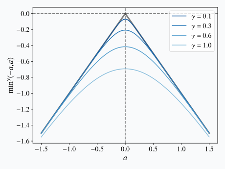
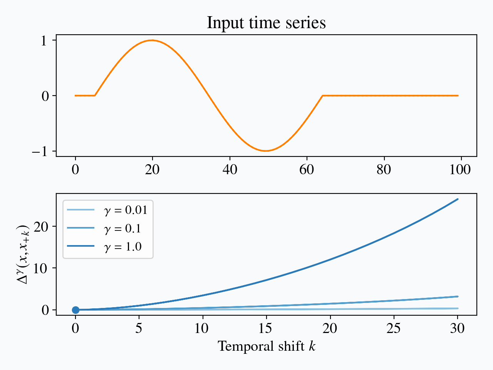
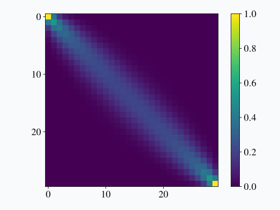
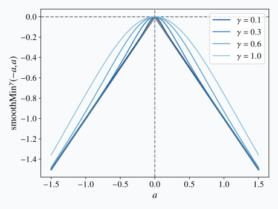

# Introduction

We have seen in a [previous blog post](dtw.html) how one can use Dynamic Time Warping (DTW) as a shift-invariant similarity measure between time series.
In this new post, we will study some aspects related to the differentiability of DTW.
The reason why we focus on differentiability is that this property is key in modern machine learning approaches.

[@cuturi2017soft] provide a nice example setting in which differentiability is desirable:
Suppose we are given a forecasting task<label for="sn-1" class="sidenote-toggle sidenote-number"></label>
<input type="checkbox" id="sn-1" class="sidenote-toggle" />
A forecasting task is a task in which we are given the beginning of a time series and the goal is to predict the future behavior of the series.in which the exact temporal localization of the 
temporal motifs to be predicted are less important than their overall shapes.
In such a setting, it would make sense to use a shift-invariant similarity measure in order to assess whether a prediction made by the model is close enough from the ground-truth.
Hence, a rather reasonable approach could be to tune the parameters of a neural network in order to minimize such a loss.
Since optimization for this family of models heavily relies on gradient descent, having access to a differentiable shift-invariant similarity measure between time series is a key ingredient of this approach.

# Differentiability of DTW

Let us start by having a look at the differentiability of Dynamic Time Warping.
To do so, we will rely on the following theorem from [@bonnans1998optimization]:

Let $\Phi$ be a metric space, $X$ be a normed space, and
$\Pi$ be a compact subset of $\Phi$.
Let us define the optimal value function $v$ as: 

$$
  v(x) = \inf_{\pi \in \Pi} f(x ; \pi) \, .
$$

Suppose that:

1. for all $\pi \in \Phi$,  the function $x \mapsto f( x ; \pi )$ is differentiable;
2. $f(x ; \pi)$ and $D_x f(x ; \pi)$ the derivative of $x \mapsto f( x ; \pi )$ are continuous on $X \times \Phi$.

If, for $x^0 \in X$, $\pi \mapsto f(x^0 ; \pi )$ has a unique minimizer $\pi^0$ over $\Pi$ then $v$ is differentiable at $x^0$ and $Dv(x^0) = D_x f(x^0 ; \pi^0)$.

Let us come back to Dynamic Time Warping, and suppose we are given a reference time series $x_\text{ref}$.
We would like to study the differentiability of

$$
\begin{aligned}
  v(x) &= DTW_2(x, x_\text{ref}) \\
       &= \min_{\pi \in \mathcal{A}(x, x_\text{ref})} \left\langle A_\pi , D_2(x, x_\text{ref}) \right\rangle^{\frac{1}{2}}
\end{aligned}
$$

then the previous Theorem tells us that $v$ is differentiable everywhere except when:

* $DTW_2(x, x_\text{ref}) = 0$ since, in this case, the non-differentiability of the square root function breaks condition 1 of the Theorem above;
* there exist several optimal paths for the DTW problem.

This second condition is illustrated in the Figure below in which we vary the value of a single element in one of the time series (for visualization purposes)
and study the evolution of $DTW_2(x, x_\text{ref})$ as a function of this value:

<figure>
    <video playsinline muted autoplay controls loop width="80%">
        <source src="fig/dtw_landscape.webm" type="video/webm" />
        <source src="fig/dtw_landscape.mp4" type="video/mp4" />
        
    </video>
    <figcaption> 
        (Non-)differentiability of Dynamic Time Warping.
    </figcaption>
</figure>

Note the sudden change in slope at the position marked by a vertical dashed line, which corresponds to a case where (at least) two distinct optimal alignment paths coexist.

# Soft-DTW and variants

Soft-DTW [@cuturi2017soft] has been introduced as a way to mitigate this
limitation.
The formal definition for soft-DTW is the following:

\begin{equation}
\text{soft-}DTW^{\gamma}(x, x^\prime) =
    \min_{\pi \in \mathcal{A}(x, x^\prime)}{}^\gamma
        \sum_{(i, j) \in \pi} d(x_i, x^\prime_j)^2
\label{eq:softdtw}
\end{equation}

where $\min{}^\gamma$ is the soft-min operator parametrized by a smoothing
factor $\gamma$.

## A note on soft-min

The soft-min operator $\min{}^\gamma$ is defined as:

\begin{equation}
    \min{}^\gamma(a_1, \dots, a_n) = - \gamma \log \sum_i e^{-a_i / \gamma}
\end{equation}

Note that when gamma tends to $0^+$, the term corresponding to the lower $a_i$
value will dominate other terms in the sum, and the soft-min then tends to the
hard minimum, as illustrated below:

<figure>
    
    <figcaption> 
        The soft-min function $\min^\gamma$ applied to the pair $(-a, a)$ for various values of $\gamma$.<label for="sn-softmin" class="sidenote-toggle sidenote-number"></label>
        <input type="checkbox" id="sn-softmin" class="sidenote-toggle" />
        This Figure is inspired from [the dedicated wikipedia page](https://en.wikipedia.org/wiki/Smooth_maximum).
    </figcaption>
</figure>

As a consequence, we have:

\begin{equation}
    \text{soft-}DTW^{\gamma}(x, x^\prime)
    \xrightarrow{\gamma \to 0^+} DTW_2(x, x^\prime)^2 \, .
\end{equation}

However, contrary to DTW, soft-DTW is differentiable everywhere for strictly positive $\gamma$ even if, for small $\gamma$ values, sudden changes can still occur in the loss landscape, as seen in the Figure below:

<figure>
    <video playsinline muted autoplay controls loop width="80%">
        <source src="fig/softdtw_landscape.webm" type="video/webm" />
        <source src="fig/softdtw_landscape.mp4" type="video/mp4" />
        
    </video>
    <figcaption> 
        Differentiability of soft-DTW.
        For the sake of visualization, soft-DTW divergence, that is a normalized version of soft-DTW [discussed below](#related-similarity-measures), is reported in place of soft-DTW.
    </figcaption>
</figure>

Note that the recurrence relation we had in Eq. [(2)](dtw.html#eq:rec) of the post on DTW is still valid with this $\min^\gamma$ formulation, hence the $O(mn)$ DTW algorithm is still valid here (the only difference being that soft-min should be used in the update rule in place of min).

## Soft-Alignment Path

It is shown in [@mensch2018] that soft-DTW can be re-written:

\begin{equation}
\text{soft-}DTW^{\gamma}(x, x^\prime) =
    \min_{p \in \Sigma} \left\langle \sum_{\pi \in \mathcal{A}(x, x^\prime)} p(\pi) A_\pi , D_2(x, x^\prime) \right\rangle - \gamma H(p)
\end{equation}

where $\Sigma$ is the set of probability distributions over paths and $H(p)$ is the entropy of $p$.

**TODO: equivalence with entropy-penalized, better justification, cf Blondel and Mensch**

Let us denote by $A_\gamma$ the "soft path" matrix that informs, for each pair
$(i, j)$, how much it will be taken into account in the matching.
$A_\gamma$ can be interpreted as a weighted average of paths in
$\mathcal{A}(x, x^\prime)$:

\begin{eqnarray}
A_\gamma =& \, \mathbb{E}_{\gamma}[A] \\
=& \, \sum_{\pi \in \mathcal{A}(x, x^\prime)} \frac{e^{-\langle A_\pi, D_2(x, x^\prime) / \gamma\rangle}}{k_{\mathrm{GA}}^{\gamma}(x, x^\prime)} A_\pi \, ,
\end{eqnarray}

where $k_{\mathrm{GA}}^{\gamma}(x, x^\prime)$ is the Global Alignment kernel [@cuturi2007kernel] 
that acts as a normalization factor here.

$A_\gamma$ can be computed with complexity $O(mn)$ and there is a link between
this matrix and the gradients of the soft-DTW similarity measure:

\begin{equation}
\nabla_{x} \text{soft-}DTW^{\gamma}(x, x^\prime) =
    \left(\frac{\partial D_2(x, x^\prime)}{\partial x} \right)^T A_\gamma
\end{equation}

## Properties

As discussed in [@janati2020spatio], soft-DTW is not invariant to time
shifts, as is DTW.
Suppose $x$ is a time series that is constant except for a motif that
occurs at some point in the series, and let us denote by $x_{+k}$ a
copy of $x$ in which the motif is temporally shifted by $k$ timestamps.
Then the quantity

\begin{equation*}
\Delta^\gamma(x, x_{+k}) = \left| \text{soft-}DTW^{\gamma}(x, x_{+k}) - \text{soft-}DTW^{\gamma}(x, x) \right|
\end{equation*}

grows linearly with $\gamma k^2$:

<figure>
    <video playsinline muted autoplay controls loop width="80%">
        <source src="fig/softdtw_shift.webm" type="video/webm" />
        <source src="fig/softdtw_shift.mp4" type="video/mp4" />
        
    </video>
    <figcaption> 
        Impact of time shifts on soft-DTW.
    </figcaption>
</figure>

The reason behind this sensibility to time shifts is that soft-DTW provides a
weighted average similarity score across all alignment paths (where stronger
weights are assigned to better paths), instead of focusing on the single best
alignment as done in DTW.

Another important property of soft-DTW is that is has a "denoising effect", in
the sense that, for a given time series $x_\text{ref}$, the minimizer of
$\text{soft-}DTW^{\gamma}(x, x_\text{ref})$ is not $x_\text{ref}$
itself but rather a smoothed version of it:

<figure>
    <video playsinline muted autoplay controls loop width="100%">
        <source src="fig/softdtw_denoising.webm" type="video/webm" />
        <source src="fig/softdtw_denoising.mp4" type="video/mp4" />
        
    </video>
    <figcaption> 
        Denoising effect of soft-DTW.
        Here, we perform a gradient descent on $x$, initialized at $x^{(0)} = x_\text{ref}$.
        Note how using larger $\gamma$ values (right column) tends to smooth out more details.<label for="sn-denoising" class="sidenote-toggle sidenote-number"></label>
        <input type="checkbox" id="sn-denoising" class="sidenote-toggle" />
        This Figure is widely inspired from Figure 2 in [@blondelmensch2020].
    </figcaption>
</figure>

## Related Similarity Measures

In [@blondelmensch2020], new similarity measures are defined, that rely on
soft-DTW.

First, **soft-DTW divergence** is defined as:

\begin{equation}
    D^\gamma (x, x^\prime) =
        \text{soft-}DTW^{\gamma}(x, x^\prime)
        - \frac{1}{2} \left(
                \text{soft-}DTW^{\gamma}(x, x) +
                \text{soft-}DTW^{\gamma}(x^\prime, x^\prime)
            \right)
\end{equation}

and this divergence has the advantage of being minimized for
$x = x^\prime$ (and being exactly 0 in that case).

Second, another interesting similarity measure introduced in the same paper is
the **sharp soft-DTW** which is:

\begin{equation}
    \text{sharp-soft-}DTW^{\gamma} (x, x^\prime) =
        \langle A_\gamma,  D_2(x, x^\prime) \rangle
\end{equation}

Note that a **sharp soft-DTW divergence** can be derived from this
(with a similar approach as for $D^\gamma$), which has the extra benefit
(over the sharp soft-DTW) of
being minimized at $x = x^\prime$.

Further note that, by pushing $\gamma$ to the $+\infty$ limit in this formula,
one gets:

\begin{equation}
\text{sharp-soft-}DTW^{\gamma}(x, x^\prime)
    \xrightarrow{\gamma \to +\infty}
    \left\langle A_\infty, D_2(x, x^\prime) \right\rangle \, ,
\end{equation}

where $A_\infty$ tends to favor diagonal matches:

<figure>
    
    <figcaption> 
        $A_\infty$ matrix for time series of length 30.
    </figcaption>
</figure>

Also, in [@hadji2020], a variant of $\min^\gamma$, called $\text{smoothMin}^\gamma$ is used in the recurrence formula.
Contrary to $\min^\gamma$, $\text{smoothMin}^\gamma$ upper bounds the min operator:

<figure>
    
    <figcaption> 
        The smooth-min function $\text{smoothMin}^\gamma$ applied to the pair $(-a, a)$ for various values of $\gamma$.
    </figcaption>
</figure>

As a consequence, the resulting similarity measure upper bounds DTW.
Note also that this paper suggests that these DTW variants are not fully suited for representation learning and additional contrastive losses should be used to help learn useful representations (this paper focuses on representation learning for videos).

# Conclusion

**TODO**
Our next blog post shbould be dedicated to drawing links between optimal transport and dynamic time warping.